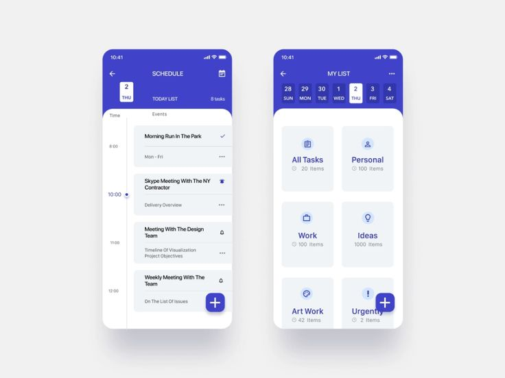

- [Introduction](#introduction)
- [Requirement](#requirement)
- [Notes](#notes)
- [Expectations](#expectations)
- [Problem Statement](#problem-statement)
  - [Interface](#interface)

## Introduction

As a mobile developer, you have to provide a reliable **Flutter** application to clients.
Your task here is to implement 2 pages (only the UI) for a small **To-do** app.

## Requirement

1. We value a **clean**, **simple** working solution.
2. Solution must work on Android and iOS.
3. You must be deployed the code on github.
4. Good understanding for how git works.
3. Include the .ipa and .apk project files on the repository.

## Notes

- Your branch name should follow this scheme `mavha-flutter-challenge/lastname-firstname`.
- Deploy as a public repository.

## Expectations

- This challenge should take around **6** to **8** hours to complete.
- Be cautious of **third-party** library usage. Don't include a 300KB library only for 1 helper function.

## Problem Statement

As a Flutter developer **Your Mission, Should You Choose To Accept It** 💻 is to build 2 pages: My list page and Schedule page.

### Interface

_For reference, you can be creative with design and UI/UX features, but you need to improve the following screens:_

Following this low fidelity wireframe you need to implement these pages as follows:

1. **My list** 
- Include the title and the date picker (see image attached).
- Include cards for each type of note (All Tasks, Personal, Work, Ideas, Artwork, Urgent). Each card must have an icon, title, and the items count. 
- Include the plus (add) button (just the button, on the right-bottom position).
- You can hardcode all the information (don't waste time on API or endpoints).
2. **Schedule** 
- Include the title and the day icon. (see image attached).
- Include the today list, and show all the events related to that day.
- Include the timeline too (use your imagination here).
- Include the plus (add) button (just the button, on the right-bottom position).
- Include the go-back button (go back to My list page).
- You can hardcode all the information (don't waste time on API or endpoints).

**[⬆ back to top](#introduction)**
